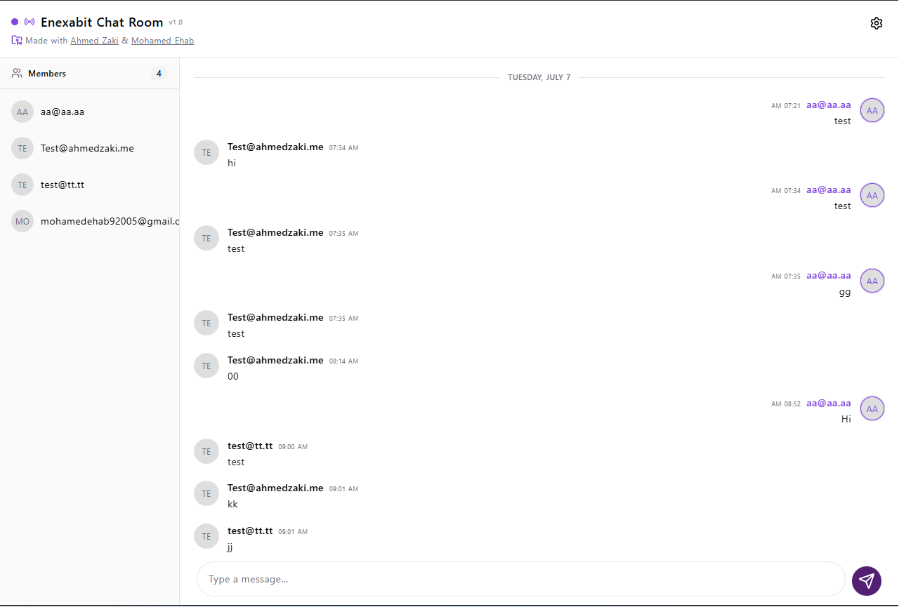
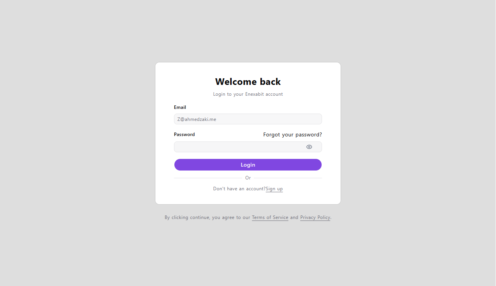
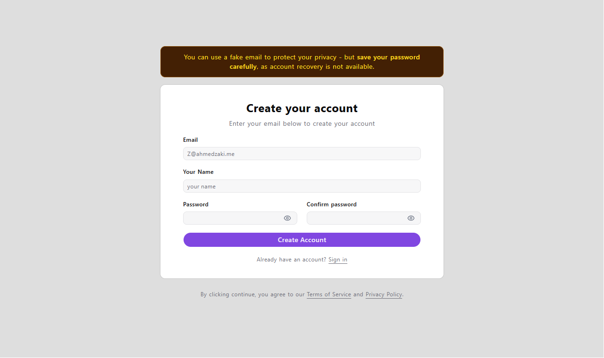

# SignalR Chat Room

> Live Demo · https://signalr-chat-room.pages.dev



## Modern Real-Time Chat Application

A production-ready real-time chat application built with **React 19**, **TypeScript**, **SignalR**, and **Vite**. The project demonstrates a modern frontend architecture with secure authentication, persistent SignalR connections, real-time messaging, and a reusable component-driven design.

---

## Key Features

### 🔐 Secure Authentication

Authentication is handled using **JWT** with protected application routes.

- User Registration & Login
- Protected Routes
- Persistent Authentication
- Axios Authorization Interceptor
- Automatic Token Injection for API Requests
- Push Notifications
- PWA

---

### ⚡ Real-Time Messaging

Powered by **ASP.NET SignalR**, providing instant bidirectional communication between connected users.

- Instant message delivery
- Live message synchronization
- Automatic SignalR reconnection
- Connection lifecycle management
- Authenticated SignalR connections using JWT

---

### 💬 Chat Experience

Designed to provide a smooth messaging experience.

- Load previous messages on startup
- Real-time incoming messages
- Message timestamps
- Sender identification

---

### 🔔 Web Push Notifications

Integrated browser push notifications keep users informed even when the application isn't actively open.

- Browser Push Notifications
- User-controlled notification subscription
- Service Worker integration with VitePWA

---

### 🎨 Modern UI

Built with **Tailwind CSS v4**, **shadcn/ui**, and **Radix UI**.

- Responsive Design
- Accessible Components
- Modern Chat Layout
- Clean Typography

---

## Tech Stack

| Category                    | Technology           |
| :-------------------------- | :------------------- |
| **Frontend**                | React 19 + Vite 8    |
| **Language**                | TypeScript           |
| **Routing**                 | React Router 7       |
| **Real-Time Communication** | SignalR              |
| **Styling**                 | Tailwind CSS 4       |
| **UI Components**           | shadcn/ui + Radix UI |
| **Forms**                   | React Hook Form      |
| **Validation**              | Zod                  |
| **HTTP Client**             | Axios                |
| **Icons**                   | Lucide React         |
| **Notifications**           | Sonner + Web Push    |
| **PWA**                     | VitePWA              |

---

## Project Architecture

The application follows a modular architecture that separates API communication, authentication, business logic, and presentation layers.

```text
src
│
├── api
│   ├── axios.ts
│   └── authInterceptor.ts
│
├── components
│   ├── auth
│   ├── chat
│   └── ui
│
├── context
│   ├── AuthContext.tsx
│   └── AuthProvider.tsx
│
├── hooks
│   ├── useAuth.ts
│   └── usePushNotifications.ts
│
├── lib
│   ├── push.ts
│   ├── storage.ts
│   └── utils.ts
│
├── pages
│   ├── auth
│   └── chat
│
├── services
│   ├── auth.service.ts
│   ├── chatConnection.ts
│   └── messages.ts
│
└── routes.tsx
```

This structure keeps networking, authentication, reusable UI components, and application logic independent, making the project easier to maintain and scale.

---

## Technical Highlights

The project focuses on clean architecture and maintainability rather than only implementing a chat interface.

### SignalR Connection Management

- Dedicated SignalR service layer
- Automatic reconnection
- JWT authentication during connection
- Connection lifecycle handling
- Clean resource disposal

### API Layer

- Centralized Axios instance
- Authentication interceptor
- Reusable service modules
- Typed API responses

### Authentication

- Context-based authentication
- Protected routing
- Persistent login sessions

### Form Handling

- React Hook Form
- Zod schema validation
- User-friendly validation messages

---

## Screenshots

<table>
  <tr>
    <td></td>
    <td></td>
  </tr>
</table>

---

## Getting Started

### Prerequisites

- Node.js (Latest LTS)
- [Chat API (.NET backend)](https://github.com/Mohamed-ehab-mohy/ChatApp.git) running locally or deployed

---

### Installation

Clone the repository

```bash
git clone https://github.com/ahmedzaki-me/signalr-chat-room.git

cd signalr-chat-room
```

Install dependencies

```bash
npm install
```

Create a `.env` file

```env
VITE_API_BASE_URL=http://localhost:5111/api/v1
```

Start the development server

```bash
npm run dev
```

---

## Production Build

```bash
npm run build
```

Preview the production build

```bash
npm run preview
```

---

## Backend Requirements

The application expects a backend that provides:

- JWT Authentication
- SignalR Hub
- Chat History API
- Message Sending Endpoint
- Web Push subscription endpoint (VAPID)

Backend repository: [Mohamed-ehab-mohy/ChatApp](https://github.com/Mohamed-ehab-mohy/ChatApp.git)

---

## Contact

**Ahmed Zaki** — Front-End Developer

[](https://ahmedzaki.me)

[](https://linkedin.com/in/ahmedzaki-me)

[](https://github.com/ahmedzaki-me)

**Mohamed Ehab** — Back-End Developer

[](https://github.com/Mohamed-ehab-mohy/ChatApp.git)

---

## License

Distributed under the MIT License.
